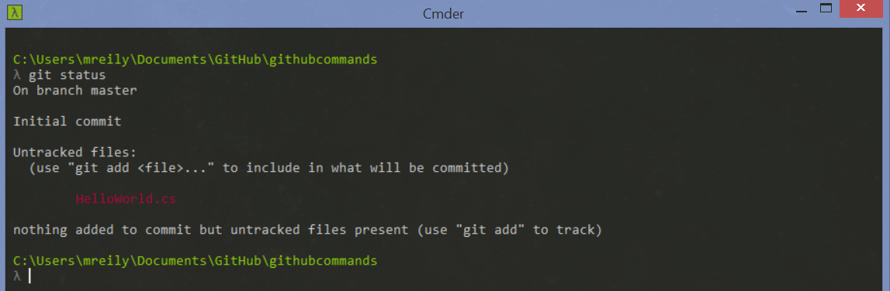
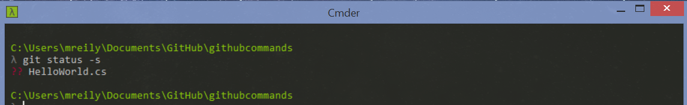
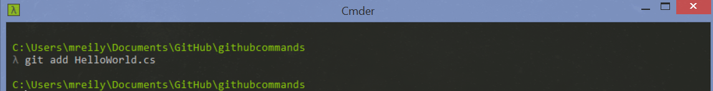
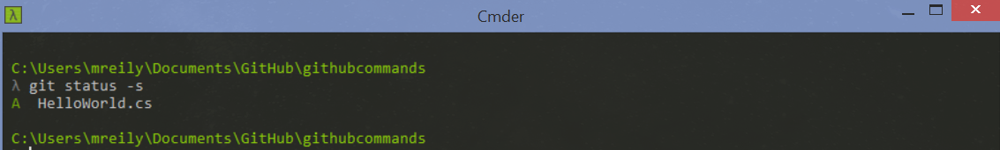
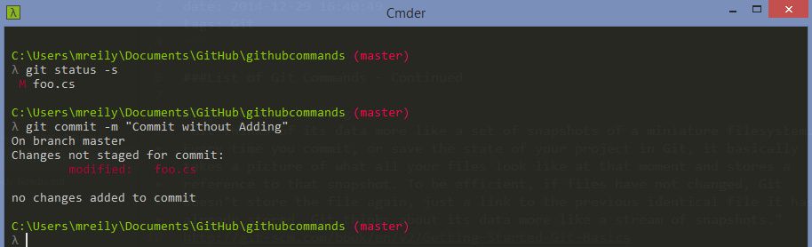

title: Git Commands for Us Newbs - Part 2
date: 2014-12-29 16:40:49
tags: Git
---

###List of Git Commands - Continued

###Basic Snapshotting
"Git thinks of its data more like a set of snapshots of a miniature filesystem. Every time you commit, or save the state of your project in Git, it basically takes a picture of what all your files look like at that moment and stores a reference to that snapshot. To be efficient, if files have not changed, Git doesn’t store the file again, just a link to the previous identical file it has already stored. Git thinks about its data more like a stream of snapshots."
http://git-scm.com/book/en/v2/Getting-Started-Git-Basics

__status__ - view the status of your files in both the working directory and the staging area

And the shorter version using -s

__add__ - adds file contents to the staging area

In the status example above you will notice a '??' notation next to the file HelloWorld.cs. This tells us that the file is not being tracked by Git.

So if we add the the

Then run status

We now have an 'A' next to our file name denoting that it has been added

__Important Note__ - Add is not only used for adding new files, but also for adding any changes you made to existing files.  

Example. You have an existing class file named foo.cs that you have updated with some new improved logic. If you do not perform an add on the file, it will not get committed to your repository.

